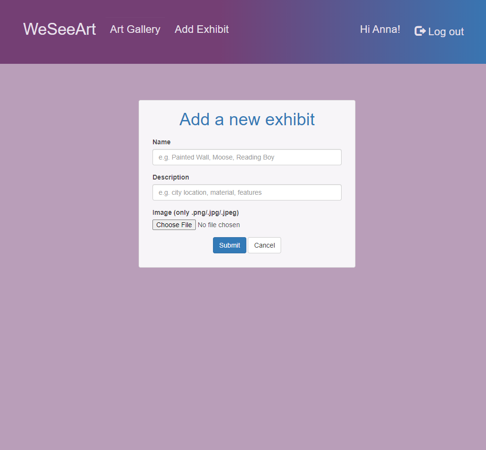

# art-network-node
## Node.js, Express.js, MongoDb, Bootstrap, HTML, CSS, JavaScript

### View Live
<https://streetart-boulder.herokuapp.com/>

A website with user-generated content.
Users can add/edit/delete street art posts  (name, photo, description) and leave/edit/delete comments.

